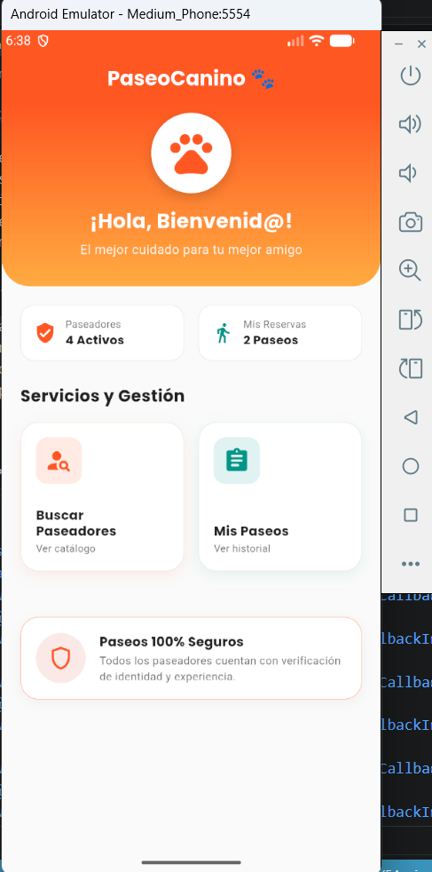
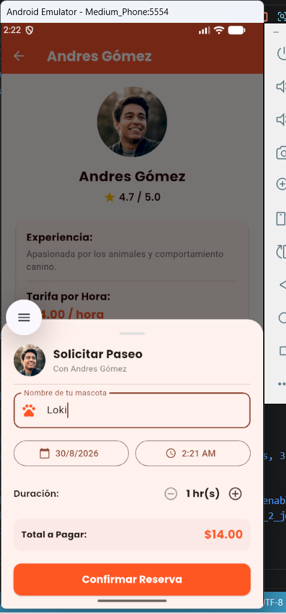
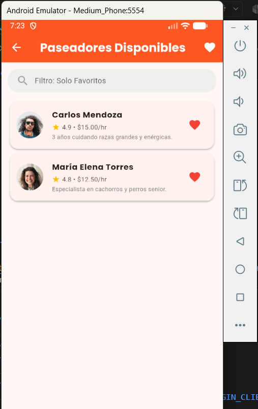

# ACT_INT1_JDHG
# 🐾 PaseoCanino - Aplicación de Gestión de Paseos para Mascotas

Aplicación móvil desarrollada en **Flutter** que permite a los dueños de mascotas solicitar paseos de forma rápida y sencilla, interactuando con un estado dinámico en pantalla.

## 📌 Descripción del Proyecto

Esta aplicación representa la pantalla principal para el rol de **Cliente (Dueño de Mascota)**. Permite solicitar paseos para perros con un solo toque, incrementando un contador en tiempo real, cambiando el estado del servicio y mostrando/ocultando dinámicamente la información del paseador asignado.

## 📌 Evidencias de Instalación

## 📌 Ejecución del comando flutter doctor: 

## 📌 Proyecto creado en Visual Studio Code

## 📌 Emulador Android Funcionando

## 📌 Aplicacion funcionando en el emulador

## 📌 Instalación del paquete

## 📌 Archivo pubspec.yaml con el paquete agregado

## 📌 Repositorio publicado en GitHub

https://github.com/joherrera-01/ACT_INT2_JDHG.git

## ⚡ Capturas de la aplicación:

## 📌 Pantalla Principal

## 📌 Descripción de las nuevas funcionalidades implementadas

BUSCAR PASEADORES

SELECCION DE PASEADOR

ESTADISTICAS DE PASEOS

## 📌 Listado de las cuatro pantallas desarrolladas y su función

PANTALLA 1
Buscar Paseadores:

PANTALLA 2
Seleccion del Paseador

PANTALLA 3
Historial de Paseos

PANTALLA 4

Confirmacion de Seleccion de Paseador

## 📌	Widgets nuevos utilizados en el proyecto.

## 📌   Descripción de las interacciones implementadas.

## 📌   Explicación de la funcionalidad desarrollada mediante setState().

## 📌   Nombre del paquete externo utilizado y explicación de para qué se utilizó,

## 📌   Evidencia de la personalización realizada: nombre, ícono, logotipo y colores.
## 📌   Capturas de pantalla de las principales pantallas de la aplicación.
## 📌   Instrucciones básicas para ejecutar el proyecto.

