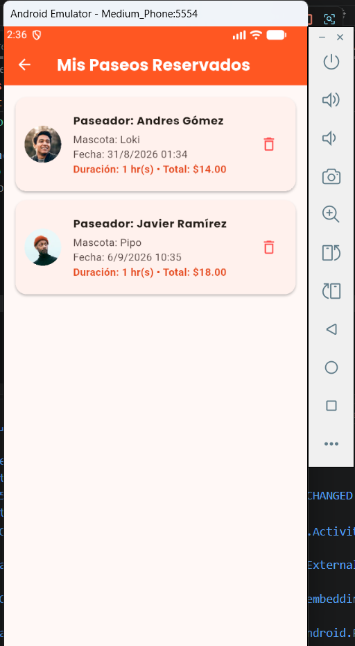
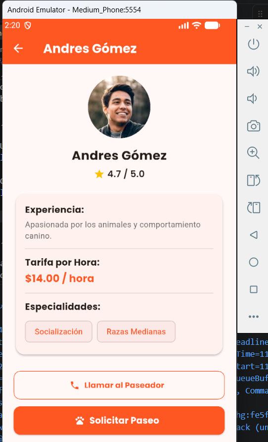
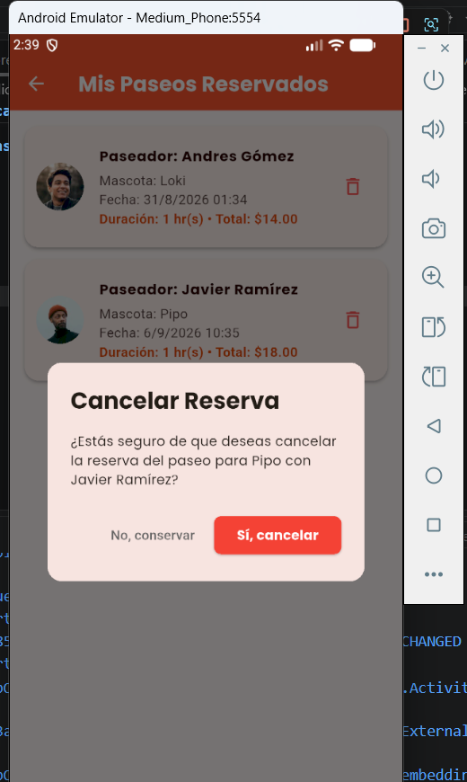
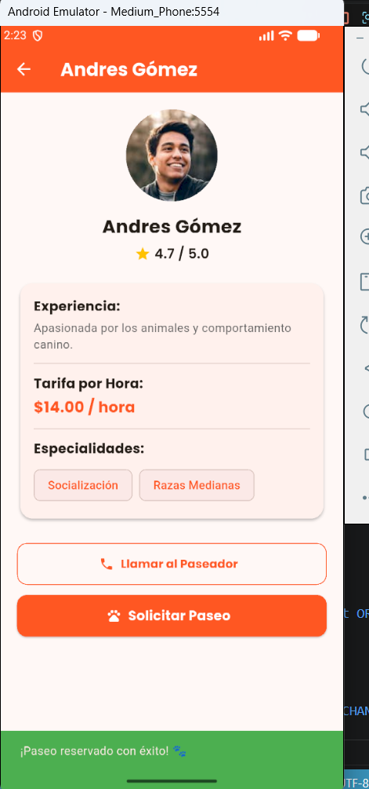

# 🐾 Descripción breve de la aplicación

PaseoCanino es una aplicación móvil desarrollada en Flutter orientada a la gestión y solicitud de servicios de paseo para mascotas. La plataforma conecta a dueños de perros con paseadores verificados, permitiéndoles explorar perfiles, revisar tarifas y calificaciones, filtrar paseadores según sus preferencias, realizar llamadas de contacto directo y programar reservas en tiempo real.

## 📌 Indicar si continuó la aplicación de la Actividad Integradora 1 o desarrolló una nueva.

Para esta entrega se continuó con el desarrollo de la aplicación de la Actividad Integradora 1. Se realizó una refactorización integral del código inicial (reestructurando la arquitectura monolítica hacia un patrón modular limpio) e integrando nuevas pantallas, modelos de datos, componentes interactivos y servicios externos.

## ⚡ Descripción de las nuevas funcionalidades implementadas.

* **`Navegación Multipantalla:`** Transición fluida entre cuatro vistas principales del sistema.

* **`Sistema de Filtro por Favoritos::`**  Capacidad de marcar/desmarcar paseadores preferidos y filtrar la lista en tiempo real.

* **`Perfil de Paseador Ampliado:`**  Visualización de detalles, biografía, áreas de especialidad y fotografía circular.

* **`Integración de Llamadas Telefónicas:`**  Lanzamiento de la app de teléfono del dispositivo al presionar el botón de contacto.

* **`Formulario Modal de Reserva:`** Ventana emergente (ModalBottomSheet) para elegir nombre de la mascota, fecha, hora y duración del servicio.

* **`Cálculo de Tarifas Automático:`** Recálculo en tiempo real del costo total en función del tiempo de paseo seleccionado.

* **`Historial de Reservas Activas::`**  Registro visual de los paseos agendados con opción de consulta detallada.

BUSCAR PASEADORES

RESERVA DE PASEADOR

ESTADISTICAS DE PASEOS

## 📌 Listado de las cuatro pantallas desarrolladas y su función

* **`HomeScreen` (`lib/screens/home_screen.dart`):** Dashboard principal con encabezado en gradiente, logotipo, métricas en tiempo real de paseadores/reservas y menú de acceso en cuadrícula.
* **`PaseadoresScreen` (`lib/screens/paseadores_screen.dart`):** Catálogo de paseadores renderizado en `ListView` con fotos circulares, puntuaciones y filtro de favoritos con `setState()`.
* **`DetallePaseadorScreen` (`lib/screens/detalle_paseador_screen.dart`):** Vista de perfil individual con experiencia, especialidades, botón de llamada telefónica y modal flotante para configurar la reserva.
* **`MisPaseosScreen` (`lib/screens/mis_paseos_screen.dart`):** Pantalla de historial que muestra las reservas generadas con su costo total, mascota, fecha y foto del paseador asignado.

PANTALLA 1
Buscar Paseadores:

PANTALLA 2
Seleccion del Paseador

PANTALLA 3
Historial de Paseos

PANTALLA 4

Confirmacion de Seleccion de Paseador

## 📌	Widgets nuevos utilizados en el proyecto.

* `ListView.builder:` Renderizado eficiente de listas dinámicas (catálogo de paseadores e historial).

* `GridView.count:` Organización en cuadrícula para las opciones de menú en el Home.

* `ListTile:` Maquetación estándar de filas con avatar, título, subtítulo y elementos finales (trailing).

* `CircleAvatar / ClipRRect:` Modelado circular para las fotos de perfil de los paseadores y el isotipo de la app.

* `Image.network:` Carga de imágenes remotas con control de estado de carga y soporte de error.

* `Divider:` Separadores de línea para organizar secciones visuales.

* `Chip / ChoiceChip:` Etiquetas visuales para mostrar especialidades y botones de selección de horario.

* `OutlinedButton:` Botón con borde para acciones secundarias como llamadas telefónicas.

## 📌   Descripción de las interacciones implementadas.

Navegación entre Pantallas: Uso de Navigator.push y Navigator.pop para desplazarse en la pila de vistas.

Despliegue de Modal Flotante: Uso de showModalBottomSheet para capturar los datos de la reserva sin salir de la pantalla.

Notificaciones Emergentes: Despliegue de SnackBar al guardar un paseo o alternar los filtros visuales.

Selectores Nativos de Fecha y Hora: Apertura de cuadros de diálogo del sistema mediante showDatePicker y showTimePicker.

## 📌   Explicación de la funcionalidad desarrollada mediante setState().

El estado local se utilizó para responder inmediatamente a las acciones del usuario sin reiniciar la vista:

Filtro de Favoritos: En PaseadoresScreen, setState() actualiza la variable booleana mostrarSoloFavoritos, forzando la re-evaluación del arreglo y filtrando la lista en pantalla.

Conmutación de Corazón: Al hacer clic en el botón de favorito de una tarjeta, setState() modifica el valor de paseador.esFavorito para cambiar el icono de gris a rojo.

Cálculo de Reserva: Dentro del modal, setState() recalcula la variable totalPagar cada vez que el usuario presiona los botones + o - para variar la duración en horas.

## 📌   Nombre del paquete externo utilizado y explicación de para qué se utilizó,

Paquete: url_launcher (v6.3.0).

Uso: Se utilizó para comunicar la aplicación de Flutter con el sistema operativo nativo. Al presionar el botón "Llamar al Paseador", la app invoca el esquema tel:+593..., abriendo directamente el marcador telefónico del teléfono móvil con el número precargado.

## 📌   Evidencia de la personalización realizada: nombre, ícono, logotipo y colores.

Nombre de la App: PaseoCanino (configurado en title de MaterialApp y en la barra superior).

Ícono y Logotipo: Representado por un contenedor circular con el ícono Icons.pets_rounded sobre fondo blanco y sombra flotante en el encabezado principal.

Colores Personalizados: Paleta gráfica basada en Colors.deepOrange como tono primario de marca, combinado con Colors.teal para acentos del historial y tonos neutros de fondo (grey.shade50).

## 📌   Capturas de pantalla de las principales pantallas de la aplicación.
## 📌   Instrucciones básicas para ejecutar el proyecto.

Para clonar y ejecutar el repositorio ([https://github.com/joherrera-01/ACT_INT2_JDHG.git](https://github.com/joherrera-01/ACT_INT2_JDHG.git)) en Windows y macOS, seguir las instrucciones específicas para cada sistema operativo.

Prerrequisitos Comunes

Tener instalado Git.

Tener instalado el SDK de Flutter (versión 3.x o superior) configurado en el PATH del sistema.

VS Code o Android Studio instalado con los complementos/plugins de Flutter y Dart.

## 📌   Ejecución en Windows

1. Clonar el Repositorio
Abrir la Terminal de comandos (cmd) o PowerShell y ejecutar:

git clone https://github.com/joherrera-01/ACT_INT2_JDHG.git
cd ACT_INT2_JDHG

2. Descargar Dependencias del Proyecto
Descarga los paquetes necesarios (incluido url_launcher):
flutter pub get

3. Verificar Entornos Disponibles
Verificar que Flutter detecte tus emuladores o navegadores:

flutter doctor

4. Ejecutar la Aplicación

En Navegador Web (Chrome) - Recomendado para evitar problemas CORS:

flutter run -d chrome --web-renderer html
En Emulador de Android:

Abrir Android Studio y ejecuta un emulador desde el AVD Manager.

flutter run
En Aplicación Nativa de Windows:

flutter run -d windows

## 📌   Ejecución en macOS

1. Clonar el Repositorio
Abrir la Terminal de macOS y ejecutar:

git clone https://github.com/joherrera-01/ACT_INT2_JDHG.git
cd ACT_INT2_JDHG

2. Descargar Dependencias del Proyecto

flutter pub get

3. Configurar Permisos para iOS/macOS (Si se usa emulador de iPhone)

Si va a probar el paquete url_launcher para llamadas en un simulador iOS o macOS, asegúrarse de tener Xcode instalado con sus herramientas de línea de comandos.

4. Ejecutar la Aplicación

En Navegador Web (Chrome / Safari):

flutter run -d chrome --web-renderer html
En Simulador de iOS (iPhone):

Abrir el simulador de iOS ejecutando en la terminal:

open -a Simulator

Ejecurar la aplicación:

flutter run

En Aplicación Nativa de macOS:

flutter run -d macos

Solución a Problemas Frecuentes al Ejecutar

-Las fotos no cargan en la Web: Asegúrarse de incluir la bandera --web-renderer html al final del comando flutter run -d chrome.

-Error de caché o dependencias antiguas: Ejecuta flutter clean seguido de flutter pub get antes de volver a lanzar la aplicación.